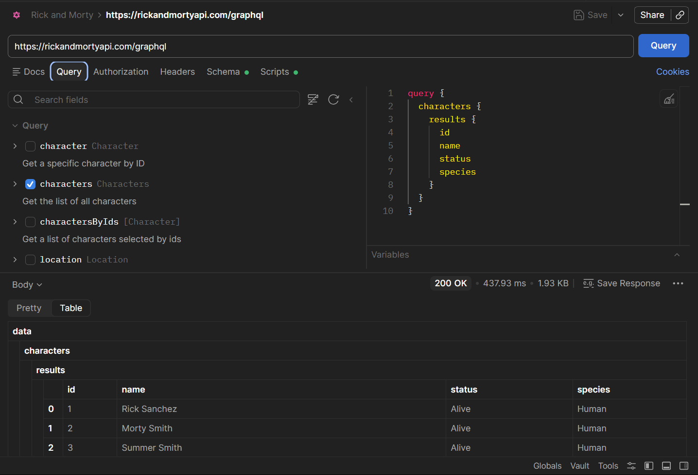
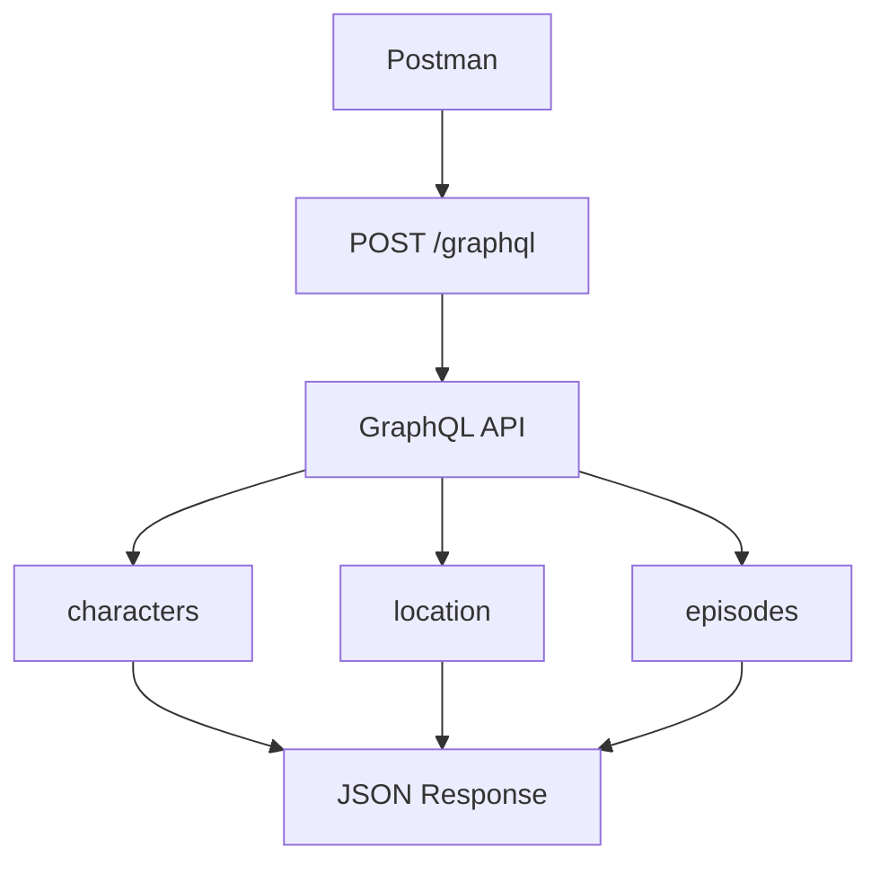
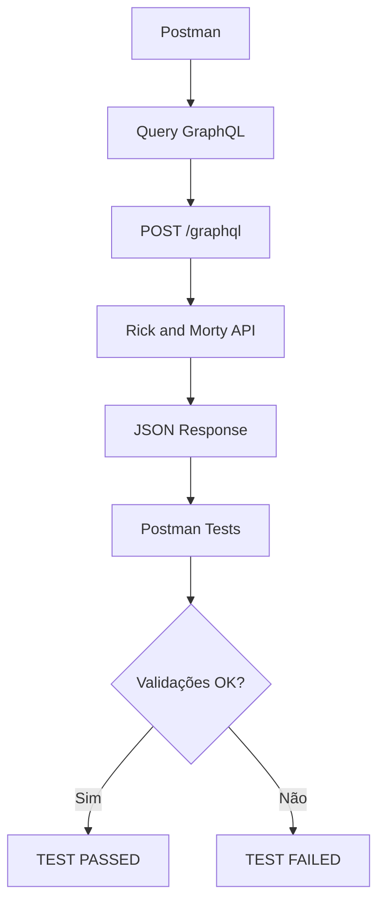
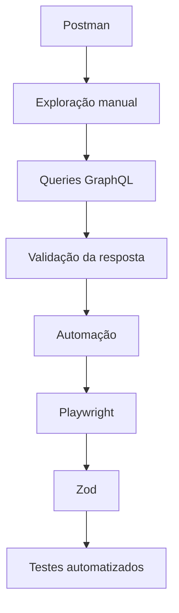

# GraphQL no Postman

<div align="center">

</div>

O **Postman** pode ser utilizado para criar, executar e validar requisições GraphQL de forma visual, facilitando a exploração da API e a criação de cenários de teste.

Neste projeto, utilizaremos o Postman para consultar a **Rick and Morty API** através de GraphQL.

---

## Endpoint

A API GraphQL utiliza o seguinte endpoint:

```text
https://rickandmortyapi.com/graphql
```

Diferentemente de uma API REST, onde normalmente temos diferentes endpoints para cada recurso, no GraphQL utilizamos um endpoint para enviar diferentes **queries**.

```text
POST https://rickandmortyapi.com/graphql
```

---

# Criando a requisição

No Postman:

1. Crie uma nova requisição.
2. Selecione o método `POST`.
3. Informe o endpoint:

```text
https://rickandmortyapi.com/graphql
```

4. No corpo da requisição, selecione:

```text
Body → GraphQL
```

O Postman disponibiliza campos específicos para:

* **Query**
* **Variables**

---

# Primeira Query

Para consultar personagens, podemos utilizar:

```graphql
query {
  characters {
    results {
      id
      name
      status
      species
    }
  }
}
```

Essa query solicita:

| Campo     | Descrição                   |
| --------- | --------------------------- |
| `id`      | Identificador do personagem |
| `name`    | Nome                        |
| `status`  | Status do personagem        |
| `species` | Espécie                     |

O GraphQL retorna somente os campos solicitados na query.

---

# 📄 Resposta

A resposta terá uma estrutura semelhante a:

```json
{
  "data": {
    "characters": {
      "results": [
        {
                    "id": "1",
                    "name": "Rick Sanchez",
                    "status": "Alive",
                    "species": "Human"
                },
                {
                    "id": "2",
                    "name": "Morty Smith",
                    "status": "Alive",
                    "species": "Human"
                },
                {
                    "id": "3",
                    "name": "Summer Smith",
                    "status": "Alive",
                    "species": "Human"
                },
                {
                    "id": "4",
                    "name": "Beth Smith",
                    "status": "Alive",
                    "species": "Human"
                },
                {
                    "id": "5",
                    "name": "Jerry Smith",
                    "status": "Alive",
                    "species": "Human"
                }
      ]
    }
  }
}
```

A principal característica é que a estrutura da resposta acompanha a estrutura da query.

```text
Query
  │
  ├── characters
  │     │
  │     └── results
  │            ├── id
  │            ├── name
  │            ├── status
  │            └── species
  │
  ▼
Response
  │
  └── data
        └── characters
              └── results
```

---

# Utilizando filtros

Também podemos utilizar argumentos na query.

Por exemplo, para buscar personagens cujo nome contenha `rick`:

```graphql
query {
  characters(
    page: 2,
    filter: {
      name: "rick"
    }
  ) {
    info {
      count
    }

    results {
      id
      name
      status
      species
    }
  }
}
```

Essa consulta utiliza:

```graphql
page: 2
```

para solicitar a segunda página e:

```graphql
filter: {
  name: "rick"
}
```

para filtrar os personagens pelo nome.

---

# Consultando múltiplos recursos

Uma das vantagens do GraphQL é poder solicitar diferentes recursos em uma única requisição.

Por exemplo:

```graphql
query {
  characters(
    page: 2,
    filter: {
      name: "rick"
    }
  ) {
    info {
      count
    }

    results {
      name
    }
  }

  location(id: 1) {
    id
  }

  episodesByIds(ids: [1, 2]) {
    id
  }
}
```

Nesse caso, uma única requisição consulta:

```text
characters
location
episodes
```

Fluxo:



---

# Query e Variables

Uma prática recomendada em GraphQL é separar os valores dinâmicos da query utilizando **variables**.

Em vez de:

```graphql
query {
  characters(
    page: 2,
    filter: {
      name: "rick"
    }
  ) {
    results {
      name
    }
  }
}
```

podemos utilizar:

```graphql
query GetCharacters($page: Int, $name: String) {
  characters(
    page: $page,
    filter: {
      name: $name
    }
  ) {
    info {
      count
    }

    results {
      id
      name
    }
  }
}
```

E no campo **Variables** do Postman:

```json
{
  "page": 2,
  "name": "rick"
}
```

Isso torna a query mais reutilizável e facilita a criação de diferentes cenários de teste.

---

# 🧪 Validação da resposta

Além de executar a query, podemos validar a resposta diretamente no Postman.

Exemplo:

```javascript
pm.test("Status code é 200", function () {
  pm.response.to.have.status(200);
});
```

Podemos também validar a estrutura da resposta:

```javascript
pm.test("Resposta possui data", function () {
  const json = pm.response.json();

  pm.expect(json).to.have.property("data");
});
```

E validar dados específicos:

```javascript
pm.test("Location possui ID 1", function () {
  const json = pm.response.json();

  pm.expect(json.data.location.id).to.eql("1");
});
```

---

# Fluxo completo



---

# GraphQL x REST

Uma diferença importante entre as duas abordagens:

| REST                               | GraphQL                       |
| ---------------------------------- | ----------------------------- |
| Múltiplos endpoints                | Geralmente um endpoint        |
| Estrutura definida pelo servidor   | Cliente define os campos      |
| Pode retornar dados não utilizados | Retorna os campos solicitados |
| `/character`                       | `/graphql`                    |
| `/location`                        | `/graphql`                    |
| `/episode`                         | `/graphql`                    |

Por exemplo, no REST:

```text
GET /api/character
GET /api/location
GET /api/episode
```

No GraphQL:

```text
POST /graphql
```

E a query determina quais dados serão retornados.

---

# Objetivo deste exemplo

O uso do Postman neste projeto permite explorar os conceitos fundamentais de GraphQL antes de automatizá-los.

A evolução natural é:




Dessa forma, o Postman pode ser utilizado como ferramenta de **exploração e validação inicial da API**, enquanto o Playwright assume a execução automatizada e repetível da suíte de testes.
