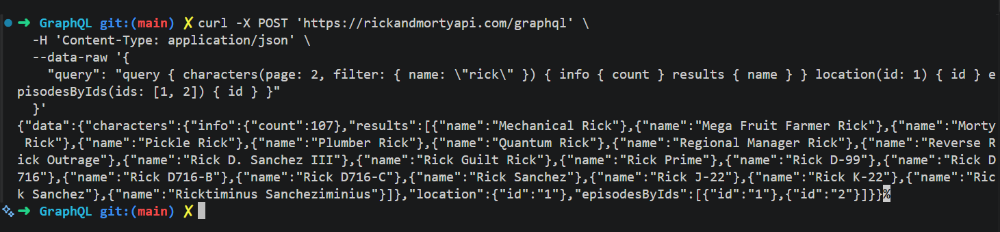
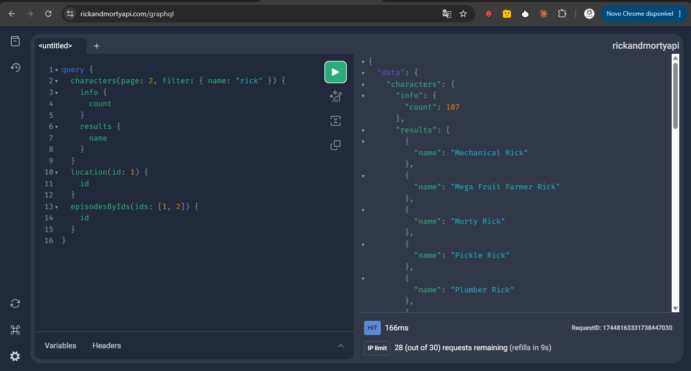
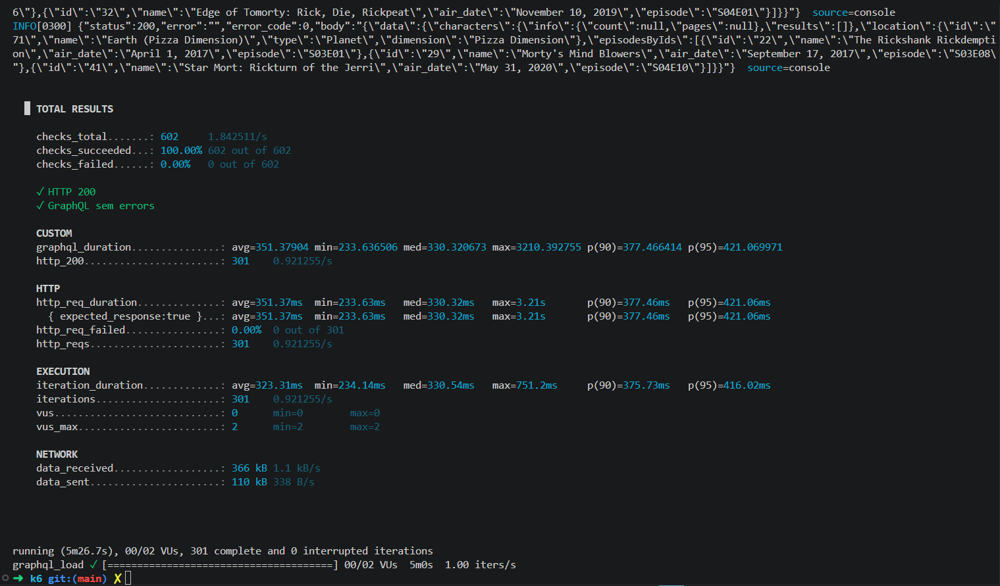
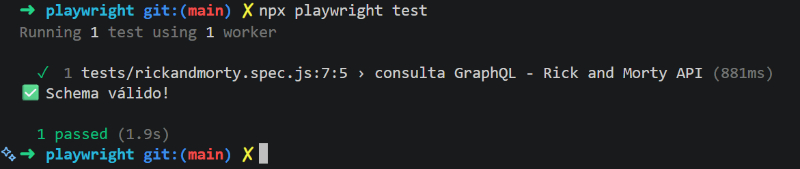
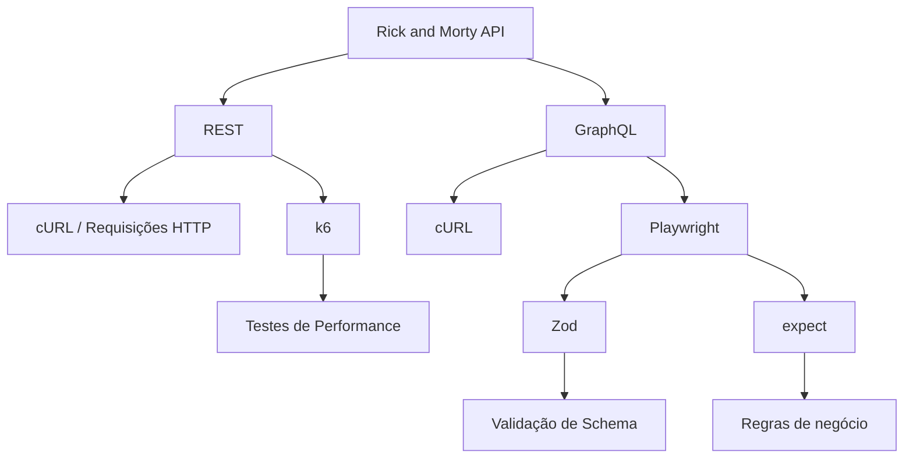
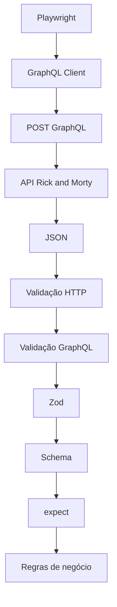

# Rick and Morty API

<div align="center">

</div>

Repositório dedicado ao estudo e à prática de **testes e automação de APIs** utilizando diferentes ferramentas e abordagens.

O projeto utiliza a **Rick and Morty API**, que disponibiliza informações sobre personagens, locais e episódios da série *Rick and Morty*, através de APIs **REST e GraphQL**.

O objetivo do projeto é explorar diferentes estratégias de consumo, validação, automação e testes de APIs.

---

## Tecnologias e ferramentas

Este projeto reúne diferentes ferramentas para trabalhar com APIs:

* **cURL** — execução manual de requisições HTTP;
* **GraphQL** — consultas à API utilizando GraphQL;
* **REST** — testes e consumo dos endpoints REST;
* **k6** — testes de carga e performance;
* **Playwright** — automação e testes de API;
* **Zod** — validação de schemas e contratos das respostas.

---

## Estrutura do projeto

```text
rick-and-morty-api/
│
├── GraphQL/
│   ├── cURL.md
│   └── GraphQL.md
│
├── REST/
│   └── rest.md
│
├── k6/
│   └── script-json.js
│
├── playwright/
│   └── README.md
│
└── README.md
```

### GraphQL

Contém exemplos e testes utilizando GraphQL.

* [cURL](./GraphQL/cURL.md) — exemplos de requisições GraphQL utilizando cURL.

<div align="center">

</div>

* [GraphQL](./GraphQL/GraphQL.md) — consultas e conceitos utilizados no projeto.

<div align="center">

</div>

### REST

Contém exemplos de consumo e testes dos endpoints REST.

* [REST API](./REST/rest.md)

### k6

Contém scripts para testes de carga e performance.

* [k6](./k6/script-json.js)

<div align="center">

</div>

### Postman

O Postman pode ser utilizado para criar, executar e validar requisições GraphQL de forma visual, facilitando a exploração da API e a criação de cenários de teste.

* [Postman](./Postman/postman.md)

Neste projeto, utilizaremos o Postman para consultar a Rick and Morty API através de GraphQL.

### Playwright

Contém a automação dos testes de API utilizando Playwright.

A implementação utiliza uma arquitetura baseada em:

* Playwright para execução dos testes;

* GraphQL para comunicação com a API;

* Zod para validação dos contratos;

* `safeParse()` para diagnóstico de erros de schema;

* `expect()` para validação das regras de negócio.

* [Playwright](./playwright/README.md)

<div align="center">

</div>


---

## Visão geral

O projeto explora diferentes níveis de teste e interação com a API:



---

## Objetivos

Este repositório tem como objetivo explorar:

* consumo de APIs REST;
* consumo de APIs GraphQL;
* criação e execução de requisições HTTP;
* testes automatizados de API;
* validação de contratos;
* testes de carga e performance;
* organização de projetos de automação;
* reutilização de código;
* separação de responsabilidades.

---

## Estratégia de testes

A abordagem utilizada nos testes de API busca separar diferentes responsabilidades.

No Playwright, por exemplo:



Dessa forma, o teste não fica responsável por toda a implementação da comunicação com a API.

---

## Documentação

| Área                                 | Descrição                           |
| ------------------------------------ | ----------------------------------- |
| [GraphQL / cURL](./GraphQL/cURL.md)  | Requisições GraphQL utilizando cURL |
| [GraphQL](./GraphQL/GraphQL.md)      | Consultas e exemplos GraphQL        |
| [REST](./REST/rest.md)               | Testes e exemplos da API REST       |
| [k6](./k6/script-json.js)            | Scripts de teste de carga           |
| [Playwright](./playwright/README.md) | Automação de testes de API          |

---

## Próximos passos

Possíveis evoluções do projeto:

* [ ] Ampliar cobertura da API REST;
* [ ] Criar mais cenários GraphQL;
* [ ] Adicionar testes negativos;
* [ ] Criar schemas para diferentes endpoints;
* [ ] Adicionar testes parametrizados;
* [ ] Evoluir a camada de API Client;
* [ ] Adicionar autenticação quando aplicável;
* [ ] Integrar os testes ao CI/CD;
* [ ] Melhorar os relatórios de execução;
* [ ] Ampliar os testes de performance com k6.

---

## Sobre a API

A **Rick and Morty API** disponibiliza informações relacionadas ao universo da série *Rick and Morty*, incluindo:

* personagens;
* episódios;
* locais;
* imagens;
* informações relacionadas aos personagens e episódios.

O projeto utiliza essa API como base para fins de **estudo, automação e demonstração de técnicas de API Testing**.

---

## Licença

Este projeto possui finalidade educacional e de demonstração de técnicas de testes, automação e performance de APIs.
