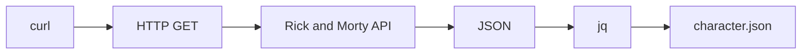
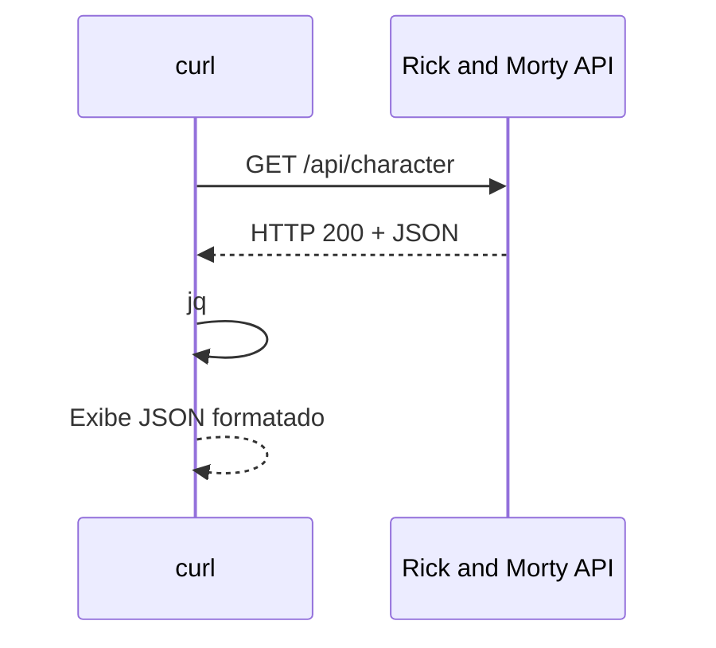

# REST API

A **Rick and Morty API** disponibiliza uma API REST para consulta de informações sobre personagens, locais e episódios da série.

## Base URL

```text
https://rickandmortyapi.com/api
```

Os principais recursos disponíveis são:

| Recurso    | Endpoint     |
| ---------- | ------------ |
| Characters | `/character` |
| Locations  | `/location`  |
| Episodes   | `/episode`   |

Exemplo da estrutura:

```json
{
  "characters": "https://rickandmortyapi.com/api/character",
  "locations": "https://rickandmortyapi.com/api/location",
  "episodes": "https://rickandmortyapi.com/api/episode"
}
```

---

# Consultando os endpoints

É possível utilizar o `curl` para realizar requisições HTTP diretamente pelo terminal.

## Characters

```bash
curl https://rickandmortyapi.com/api/character | jq
```

## Locations

```bash
curl https://rickandmortyapi.com/api/location | jq
```

## Episodes

```bash
curl https://rickandmortyapi.com/api/episode | jq
```

O `jq` é utilizado para formatar e facilitar a leitura do JSON retornado pela API.

---

# Salvando a resposta em um arquivo

O `curl` também pode salvar diretamente o conteúdo da resposta.

### Characters

```bash
curl -sS -o character.json \
  https://rickandmortyapi.com/api/character
```

### Locations

```bash
curl -sS -o location.json \
  https://rickandmortyapi.com/api/location
```

### Episodes

```bash
curl -sS -o episode.json \
  https://rickandmortyapi.com/api/episode
```

Após a execução, os arquivos serão criados no diretório atual:

```text
.
├── character.json
├── location.json
└── episode.json
```

---

# ⚙️ Opções utilizadas no `curl`

No comando:

```bash
curl -sS -o character.json https://rickandmortyapi.com/api/character
```

são utilizadas algumas opções do `curl`:

| Opção | Descrição                                                      |
| ----- | -------------------------------------------------------------- |
| `-o`  | Salva o conteúdo da resposta em um arquivo                     |
| `-s`  | Executa em modo silencioso, ocultando informações de progresso |
| `-S`  | Mostra mensagens de erro mesmo quando `-s` está habilitado     |

### Por que utilizar `-sS`?

O `-s` sozinho oculta praticamente toda a saída do `curl`, inclusive algumas mensagens de erro.

Ao utilizar `-sS` temos um comportamento mais adequado para scripts:

* não exibe informações desnecessárias;
* continua exibindo erros quando a requisição falha.

---

# Visualizando o JSON

Depois de salvar a resposta em `character.json`, podemos utilizar o `jq` para visualizar o conteúdo formatado:

```bash
jq . character.json
```

O mesmo pode ser feito para os demais arquivos:

```bash
jq . location.json
jq . episode.json
```

---

# Salvando a resposta utilizando pipe

Outra forma de salvar o JSON é enviar a saída do `curl` para o `jq` e redirecionar o resultado para um arquivo:

```bash
curl -s https://rickandmortyapi.com/api/character | jq > character.json
```

Nesse caso, o fluxo é:



A diferença é que o `jq` processa e formata o JSON **antes de gravá-lo no arquivo**.

---

# `-o` vs `jq > arquivo`

Existem duas abordagens no projeto.

### Utilizando `-o`

```bash
curl -sS -o character.json \
  https://rickandmortyapi.com/api/character
```

Nesse caso, o `curl` salva a resposta diretamente no arquivo.

### Utilizando `jq`

```bash
curl -s https://rickandmortyapi.com/api/character \
  | jq > character.json
```

Nesse caso:

```text
curl
 ↓
Resposta JSON
 ↓
jq
 ↓
JSON formatado
 ↓
Arquivo
```

A segunda abordagem é útil quando queremos **processar ou formatar a resposta antes de salvá-la**.

---

# Testando os três recursos

Podemos consultar os principais endpoints em sequência:

```bash
curl -sS https://rickandmortyapi.com/api/character | jq
curl -sS https://rickandmortyapi.com/api/location | jq
curl -sS https://rickandmortyapi.com/api/episode | jq
```

Ou salvar as respostas:

```bash
curl -sS -o character.json https://rickandmortyapi.com/api/character
curl -sS -o location.json https://rickandmortyapi.com/api/location
curl -sS -o episode.json https://rickandmortyapi.com/api/episode
```

---

# Estrutura básica de uma requisição REST

Os exemplos acima utilizam o método HTTP `GET`:

```text
GET /api/character
GET /api/location
GET /api/episode
```

De forma simplificada:



---

# Objetivo

Esta documentação apresenta o uso básico da API REST através do terminal, utilizando:

* `curl` para realizar requisições HTTP;
* `jq` para visualizar e formatar JSON;
* redirecionamento (`>`) para salvar resultados;
* opção `-o` para salvar respostas diretamente em arquivos.

Esses comandos servem como base para os próximos passos do projeto, como **automação de testes, validação de respostas e testes de performance com k6**.
