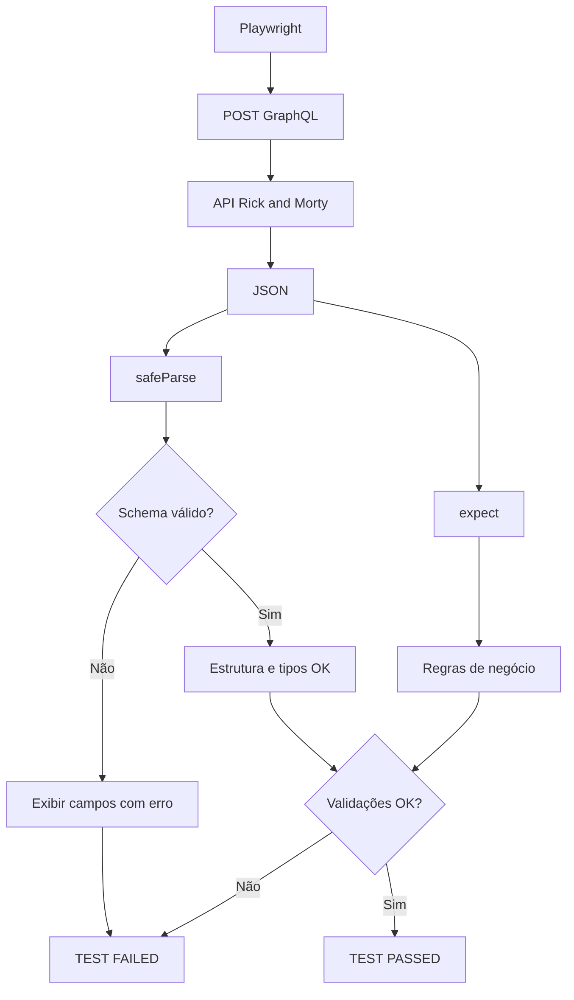
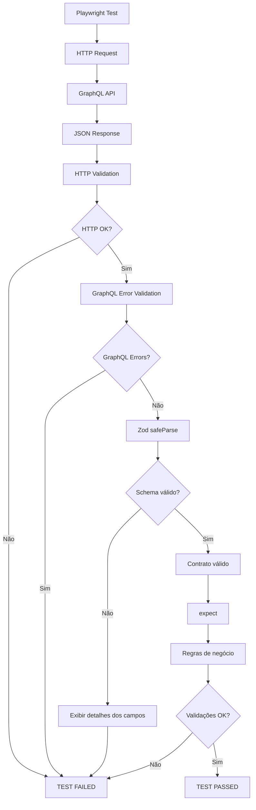

# Testes de API GraphQL com Playwright

Este projeto demonstra como utilizar **Playwright** para testes automatizados de APIs GraphQL, combinando **Zod** para validação do contrato das respostas e `expect` para validação das regras de negócio.

## Arquitetura do teste



O fluxo principal é:

> **Playwright faz a requisição → Zod valida o contrato → `expect` valida as regras de negócio.**

---

## Tecnologias

* **Playwright** — execução dos testes e requisições HTTP.
* **Zod** — validação e definição dos schemas das respostas.
* **JavaScript** — linguagem utilizada nos testes.
* **GraphQL** — protocolo utilizado para consulta à API.

---

## Estrutura do projeto

Uma organização recomendada é:

```text
rick-and-morty-api/
│
├── tests/
│   └── rickandmorty.spec.js
│
├── schemas/
│   └── rickAndMortySchema.js
│
├── utils/
│   └── validateSchema.js
│
├── package.json
└── playwright.config.js
```

### Responsabilidade de cada diretório

| Diretório/arquivo      | Responsabilidade                                  |
| ---------------------- | ------------------------------------------------- |
| `tests/`               | Contém os testes automatizados                    |
| `schemas/`             | Contém os contratos de resposta definidos com Zod |
| `utils/`               | Contém funções reutilizáveis pelos testes         |
| `playwright.config.js` | Configurações do Playwright                       |
| `package.json`         | Dependências e scripts do projeto                 |

---

# 1. Teste com Playwright

O Playwright é responsável por enviar a requisição para a API GraphQL.

Exemplo:

```javascript
import { test, expect } from '@playwright/test';

test('consulta GraphQL - Rick and Morty API', async ({ request }) => {
  const response = await request.post(
    'https://rickandmortyapi.com/graphql',
    {
      headers: {
        'Content-Type': 'application/json',
      },
      data: {
        query: `
          query {
            characters(
              page: 2,
              filter: { name: "rick" }
            ) {
              info {
                count
              }
              results {
                name
              }
            }

            location(id: 1) {
              id
            }

            episodesByIds(ids: [1, 2]) {
              id
            }
          }
        `,
      },
    }
  );

  const body = await response.json();

  expect(response.ok()).toBeTruthy();
  expect(body.errors).toBeUndefined();
});
```

Nesse caso, não é necessário abrir um navegador. O Playwright está sendo utilizado como ferramenta de **API Testing**, através do objeto `request`.

---

# 2. Schema com Zod

O Zod define o contrato esperado para a resposta da API.

Arquivo:

```text
schemas/rickAndMortySchema.js
```

Exemplo:

```javascript
import { z } from 'zod';

export const rickAndMortyResponseSchema = z.object({
  data: z.object({
    characters: z.object({
      info: z.object({
        count: z.number().int().nonnegative(),
      }),

      results: z.array(
        z.object({
          name: z.string().min(1),
        })
      ),
    }),

    location: z.object({
      id: z.string().min(1),
    }),

    episodesByIds: z.array(
      z.object({
        id: z.string().min(1),
      })
    ),
  }),

  errors: z.undefined().optional(),
});
```

O schema garante que a resposta possua a estrutura esperada.

Por exemplo:

```text
data
├── characters
│   ├── info
│   │   └── count → number
│   │
│   └── results → array
│       └── name → string
│
├── location
│   └── id → string
│
└── episodesByIds → array
    └── id → string
```

---

# 3. Por que utilizar `safeParse()`?

O Zod possui diferentes formas de validar dados.

Uma delas é:

```javascript
schema.parse(data);
```

Quando a validação falha, `parse()` lança uma exceção.

Para testes automatizados, `safeParse()` pode ser mais conveniente porque permite controlar o tratamento do erro.

```javascript
const result = schema.safeParse(body);
```

O resultado será semelhante a:

```javascript
{
  success: true,
  data: ...
}
```

quando a validação for bem-sucedida.

Quando houver erro:

```javascript
{
  success: false,
  error: ...
}
```

Isso permite apresentar informações mais úteis no terminal.

---

# 4. Função reutilizável `validateSchema`

Como o projeto pode possuir diversos schemas, não é recomendado repetir o tratamento do `safeParse()` dentro de cada teste.

Em vez disso, criamos uma função reutilizável:

```text
utils/
└── validateSchema.js
```

Arquivo:

```javascript
export function validateSchema(schema, data) {
  const result = schema.safeParse(data);

  if (!result.success) {
    console.error('\n❌ Schema inválido!\n');

    result.error.issues.forEach((issue) => {
      console.error(`Campo: ${issue.path.join('.')}`);
      console.error(`Erro:  ${issue.message}`);
      console.error(`Código: ${issue.code}`);
      console.error('---');
    });

    return false;
  }

  console.log('✅ Schema válido!');

  return true;
}
```

A função recebe dois parâmetros:

```javascript
validateSchema(schema, data);
```

* `schema` → schema Zod que será utilizado na validação.
* `data` → resposta recebida da API.

---

# 5. Utilizando o `validateSchema` no teste

O teste pode importar o schema e a função de validação:

```javascript
import { test, expect } from '@playwright/test';

import {
  rickAndMortyResponseSchema
} from '../schemas/rickAndMortySchema.js';

import {
  validateSchema
} from '../utils/validateSchema.js';
```

Depois da requisição:

```javascript
const body = await response.json();

expect(response.ok()).toBeTruthy();
expect(body.errors).toBeUndefined();

expect(
  validateSchema(
    rickAndMortyResponseSchema,
    body
  )
).toBeTruthy();
```

O teste fica responsável apenas por:

1. Fazer a requisição.
2. Obter a resposta.
3. Validar o status HTTP.
4. Validar o contrato da resposta.
5. Validar as regras de negócio.

---

# 6. Teste completo

Um exemplo completo:

```javascript
import { test, expect } from '@playwright/test';

import {
  rickAndMortyResponseSchema
} from '../schemas/rickAndMortySchema.js';

import {
  validateSchema
} from '../utils/validateSchema.js';

test('consulta GraphQL - Rick and Morty API', async ({ request }) => {

  const response = await request.post(
    'https://rickandmortyapi.com/graphql',
    {
      headers: {
        'Content-Type': 'application/json',
      },

      data: {
        query: `
          query {
            characters(
              page: 2,
              filter: { name: "rick" }
            ) {
              info {
                count
              }

              results {
                name
              }
            }

            location(id: 1) {
              id
            }

            episodesByIds(ids: [1, 2]) {
              id
            }
          }
        `,
      },
    }
  );

  const body = await response.json();

  // Validação HTTP
  expect(response.ok()).toBeTruthy();

  // Validação de erros GraphQL
  expect(body.errors).toBeUndefined();

  // Validação do contrato da API
  expect(
    validateSchema(
      rickAndMortyResponseSchema,
      body
    )
  ).toBeTruthy();

  // Regras de negócio
  expect(
    body.data.characters.info.count
  ).toBeGreaterThan(0);

  expect(
    body.data.characters.results.length
  ).toBeGreaterThan(0);

  expect(
    body.data.location.id
  ).toBe('1');

  expect(
    body.data.episodesByIds
  ).toHaveLength(2);
});
```

---

# 7. Contrato x regra de negócio

É importante separar esses dois tipos de validação.

### Contrato da API

Responsável por verificar **estrutura e tipos**:

```javascript
rickAndMortyResponseSchema
```

Por exemplo:

```text
count → number
name  → string
id    → string
```

O objetivo é detectar mudanças inesperadas no contrato da API.

### Regra de negócio

Responsável por verificar se os valores atendem aos requisitos do teste:

```javascript
expect(body.data.characters.info.count)
  .toBeGreaterThan(0);
```

```javascript
expect(body.data.episodesByIds)
  .toHaveLength(2);
```

Portanto:

```text
Zod
 ↓
"A resposta possui a estrutura correta?"

expect
 ↓
"Os dados retornados atendem ao comportamento esperado?"
```

---

# 8. Diagnóstico de erros

Uma das principais vantagens da abordagem com `safeParse()` é obter informações detalhadas quando o contrato da API é quebrado.

Por exemplo, se a API retornar:

```json
{
  "data": {
    "characters": {
      "info": {
        "count": "10"
      }
    }
  }
}
```

mas o schema espera:

```javascript
count: z.number()
```

o terminal poderá apresentar:

```text
❌ Schema inválido!

Campo: data.characters.info.count
Erro: Invalid input: expected number, received string
Código: invalid_type
---
```

Assim, fica fácil identificar:

* qual campo apresentou problema;
* qual tipo era esperado;
* qual tipo foi recebido;
* em qual parte da resposta o erro ocorreu.

---

# 9. Outros schemas

A mesma arquitetura pode ser utilizada para diferentes APIs.

Por exemplo:

```text
schemas/
├── rickAndMortySchema.js
├── userSchema.js
├── postSchema.js
└── countrySchema.js
```

E todos podem utilizar a mesma função:

```text
utils/
└── validateSchema.js
```

Exemplo:

```javascript
validateSchema(userSchema, body);
```

ou:

```javascript
validateSchema(postSchema, body);
```

ou:

```javascript
validateSchema(countrySchema, body);
```

Isso evita duplicação de código e facilita a manutenção dos testes.

---

# 10. Fluxo completo

A arquitetura final pode ser representada assim:



## Resumo

A responsabilidade de cada componente fica bem definida:

| Componente           | Responsabilidade                                  |
| -------------------- | ------------------------------------------------- |
| **Playwright**       | Executar o teste e realizar a requisição HTTP     |
| **GraphQL**          | Consultar os dados da API                         |
| **Zod**              | Validar o contrato, estrutura e tipos da resposta |
| **safeParse()**      | Permitir tratamento detalhado dos erros do schema |
| **validateSchema()** | Centralizar e reutilizar o tratamento dos erros   |
| **expect()**         | Validar regras de negócio e resultados esperados  |

Essa estrutura permite crescer o projeto adicionando novos testes e schemas sem precisar duplicar a lógica de validação.
