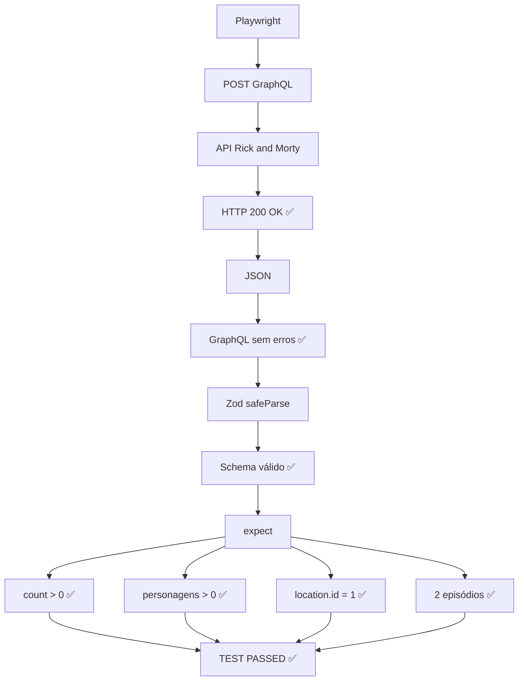

# Resultado

```bash
npx playwright test

Running 1 test using 1 worker

  ✓  1 tests/rickandmorty.spec.js:5:5 › consulta GraphQL - Rick and Morty API (953ms)
✅ Schema válido!

  1 passed (2.0s)
```

Perfeito! 🎉 Seu teste está funcionando corretamente.

O resultado:

```text
✓ consulta GraphQL - Rick and Morty API
✅ Schema válido!

1 passed (2.0s)
```

significa que **todas as camadas de validação passaram**.

### O que aconteceu




### O mais interessante

Agora seu teste não está apenas verificando:

```javascript
expect(response.ok()).toBeTruthy();
```

Ele está fazendo **três níveis de validação**:

**1. HTTP**

```javascript
expect(response.ok()).toBeTruthy();
```

Verifica se a requisição HTTP foi bem-sucedida.

**2. GraphQL**

```javascript
expect(body.errors).toBeUndefined();
```

Verifica se a execução da query GraphQL não retornou erros.

**3. Contrato + regra de negócio**

```javascript
validateSchema(rickAndMortyResponseSchema, body);
```

Valida estrutura e tipos com Zod.

E:

```javascript
expect(body.data.characters.info.count).toBeGreaterThan(0);
```

valida o comportamento esperado.

Isso já é uma **boa base para um framework de API testing**, principalmente porque você pode reutilizar `validateSchema()` em vários endpoints.

O próximo passo natural seria separar também a **query GraphQL** e a **requisição HTTP** do teste, deixando o `.spec.js` focado apenas no cenário e nas validações. Isso deixa o projeto bem mais escalável quando você começar a ter vários testes.
